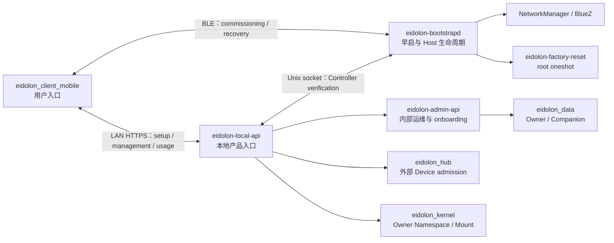
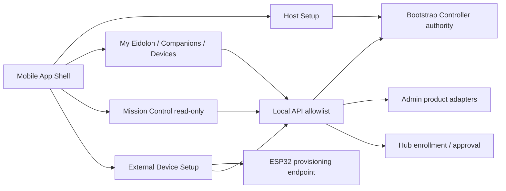

# Eidolon OS 本地 Bootstrap 与 Mobile 用户层实施计划

- 状态：Accepted，实施中
- 日期：2026-08-06
- 范围：本地首次接入、初始化、日常管理、换网、Controller 恢复、Reset、Owner 上下文
- 暂不包含：远程访问、Cloud Relay、跨网络账户登录、OTA 商业发布体系

## 0. 当前实施状态

截至 2026-08-06，Phase 0 基座和 Phase 1/2A 的开发实现已经落地：

- `eidolon-bootstrapd`、`eidolon-bootstrapctl`、`eidolon-local-api` 独立 entrypoint。
- Bootstrap 通过 `BootstrapStateStore` Port 保存必要权威状态；当前默认 adapter 是独占 SQLite，也有不持久化的 In-memory 测试实现。
- Commissioning 传输与安全分层为 `CommissioningListener/Link`、pinned TLS 和应用协议；BlueZ GATT adapter 与 In-memory link 都已实现。
- `NetworkProvisioning` 保持 scan/stage/confirm/rollback 窄 Port；NetworkManager D-Bus 与 In-memory adapter 都已实现，未引入 SoftAP。
- daemon 启停和异常属于 systemd/journald 诊断日志，不再写入 Bootstrap authority store。
- 单实例 authority lock 防止两个 bootstrapd 同时运行；身份文件拒绝软链接和错误权限。
- systemd `Restart=always`、无限重试窗口和 watchdog；不依赖 `network-online.target`。
- Local API 已实现只读 descriptor/state/host snapshot、无状态 Host proof，以及 LAN 专用 Controller challenge、短期 session 签发和 session 当前性校验；仍未接入 Admin 高权限面或产品 mutation。
- Local API session 只在进程内保存 opaque token 的 hash，默认 15 分钟；每次使用会向 Bootstrap 重新验证 Controller Grant 和 `reset_epoch`。Local API restart 只使短期 session 失效，不改变 durable Controller Grant。
- Mobile 无网向导已实现：发现附近广播、验证 signed endpoint、输入 6 位短期 Setup 码、pin TLS SPKI、扫描/配置 Wi-Fi、生成独立 Controller key 并完成认领。Setup 码和 Wi-Fi 密码只保留在内存。
- Controller Grant、operation journal、session 单次消费与 claim 权威迁移已落地；已认领换网使用 Controller challenge，不复用开箱 secret。
- Mobile 默认入口是首次 Setup / 我的 Eidolon；旧 Audio demo 不参与本闭环。Workspace onboarding 仍是后续子项目，因此 Host commissioning 完成不等价于 Workspace ready。
- Production 默认 fail closed：缺少制造身份时不生成临时产品身份，且拒绝签发开发 Setup 码。
- AST 架构测试禁止 Bootstrap import Admin app、Data、Memory、NATS、Supervisor、torch 和 uvicorn。
- 开发树莓派上已经安装并由 systemd 常驻运行 `eidolon-bootstrapd`；Android 平板已完成一次真实 Host commissioning 闭环，包括 BLE 发现、signed endpoint、pinned TLS、NetworkManager 配网确认、Controller Grant 和 claim。
- 该实机结果只覆盖当前开发 Pi、Android 平板和当前路由器，不能外推为 2.4/5 GHz、隐藏 SSID、WPA3、DHCP 故障、guest isolation、App kill 和重启恢复矩阵均已验收。
- 最近一次实机审计中 Host 为 `claimed/connected/normal`、`reset_epoch=2`，但 `workspace_state=absent`；`eidolon-local-api.service` 和完整 `eidolon-stack.service` 尚未运行。因此当前闭环是 Host commissioning，不是完整 Workspace 开箱完成。

尚未完成并且不能宣称完成：完整 Pi/Android 路由器与故障矩阵、Controller-authenticated
Local API 的 Pi/Android 实机部署验收、Owner/Workspace 初始化 saga、产品二维码制造流程、物理 recovery GPIO/按键、
Factory Reset manifests、iOS、Local API/完整 stack 的产品 systemd 联动与故障注入。

## 1. 背景与目标

Eidolon OS 运行在无屏树莓派主机上。最终用户不能依赖 SSH、HDMI、键盘或预先知道主机 IP，因此需要一个开箱即用的本地用户层：

1. 主机没有网络时，Mobile App 能识别并安全接入附近的 Eidolon OS。
2. App 能配置或切换树莓派 Wi-Fi，失败后设备仍可恢复。
3. App 能完成首个 Owner、主 Companion 和 Workspace 初始化。
4. 初始化后，App 成为本地日常管理与语音使用入口。
5. 丢失手机、网络配置错误或整机转让时，存在明确且安全的恢复路径。

`eidolon_client_mobile` 继续作为 Mobile codebase。树莓派侧能力放入
`eidolon_admin` codebase，但不能直接并入现有 Admin FastAPI 进程。

### 1.1 术语与逻辑边界

- **Setup**：Mobile 面向用户的引导与编排。它读取 Host 权威状态并投影步骤进度，不保存第二份可写的“setup 已完成”状态。
- **Bootstrap**：树莓派上永远常驻、自动重启的最小控制平面。它拥有 Host Identity、reset epoch、commissioning session 和后续 Controller/network/recovery 状态迁移。
- **Commissioning**：Bootstrap 提供的一段限时、认证控制会话，用于建立 Controller 和配置网络；它不是整个 Setup UI，也不是日常业务 API。
- **Local API**：网络可达后 Mobile 的本地产品入口。地址或 mDNS 只解决可达性；Descriptor 选定目标身份，nonce-bound Host proof 才把当前连接绑定到该身份。
- **Claim**：Bootstrap 接受一个 Controller 身份并形成可撤销授权的权威迁移；不能由 Mobile 本地标记代替。
- **Workspace onboarding**：Owner/Companion/Workspace 的业务初始化，权威在 Data/Admin，不属于 Bootstrap 自己的数据模型。
- **Device setup**：为 ESP32 等外部 Device 配置其网络并将其准入某个 Owner 的用户流程。它由“设备本地 provisioning”和“Hub enrollment/approval/binding”两段组成，不属于 Host Bootstrap，也不使用 Host Setup 码或 Controller Identity 充当 Device Identity。

因此当前开发闭环严格按以下顺序推进：

```text
Host: bootstrapd 常驻
  -> 开发者签发短期 6 位 Setup 码
  -> Mobile 通过固定 Service UUID 发现附近 Host
  -> Mobile 验证 BLE signed endpoint 的身份自洽性
  -> Mobile 建立 pinned TLS 并提交 Setup 码
  -> Host commissioning 授权完成
  -> NetworkManager stage/confirm + Controller claim
  -> [下一步] Controller-authenticated Local API
  -> Owner / Companion / Workspace onboarding
  -> Mobile 产品能力与外部 Device setup
  -> Mission Control 只读观测
  -> [最后迁移] conversation / Audio Channel
```

`Host access setup`、`Host commissioning` 和 `Workspace onboarding` 是三个连续但不同的完成点。当前 Mobile 不会因为读到了 `workspace_state=absent` 就修改 Bootstrap 状态，也不会把只读连接误报为整机开箱初始化完成。

## 2. 本次复盘后的决策变化

### 2.1 修订结论

上一版建议新建独立 `eidolon_bootstrap` 仓库。重新检查现有代码后，这个结论过度强调仓库隔离，低估了 `eidolon_admin` 已经承担的系统集成、Owner onboarding、服务健康和部署编排职责。

修订为：

> Bootstrap 放在 `eidolon_admin` 项目中实现；代码仓库共享，运行时、权限、入口和数据必须隔离。

目标形态是同一个 codebase 中的三个运行单元：

| 运行单元 | 启动阶段 | 网络暴露 | 权限 | 职责 |
|---|---|---|---|---|
| `eidolon-bootstrapd` | 早于完整 Eidolon stack | 不直接暴露普通 LAN API；BLE、Unix socket | 独立用户 + 最小系统权限 | Host Identity、commissioning、Controller Grant、NetworkManager、恢复与 Reset 编排 |
| `eidolon-local-api` | 独立于 Admin，可降级启动 | App 可访问的本地 HTTPS | 普通用户 | Controller 鉴权、Owner scope、产品 API/BFF、调用内部服务 |
| `eidolon-admin-api` | 完整 stack | 产品默认仅 loopback/支持模式 | 普通用户，但拥有运维能力 | 现有运维 UI、Supervisor、配置、日志、内部 onboarding |

代码同仓能够复用配置、测试、发布和内部 client；进程隔离保证 Admin 崩溃、完整 stack 未就绪或网络错误时，Bootstrap 仍然可用。

### 2.2 对上一版其他内容的修订

1. **二维码不能被当作开发前置条件。** 开发阶段使用每台 Pi 临时生成的 6 位 Setup 码；产品阶段才进入制造身份和二维码/等价带外凭据流程。
2. **固定输入只允许做 Debug 入口，不作为固定秘密。** App 可以固定 BLE Service UUID、开发模式入口和默认字段，但真实 Pi 联调不应让所有设备共用一个硬编码 commissioning secret。
3. **SoftAP 不进入第一个 MVP。** 先验证 BLE + NetworkManager 是否能形成稳定闭环；SoftAP 是验证后的 fallback，不能预先假设单 Wi-Fi 芯片 AP/STA 并发可靠。
4. **Local API 先做最小面。** 第一阶段只覆盖 setup、system status、network 和 controller，不立即代理整个 Admin。
5. **Reset wipe list 不能靠路径猜测。** 每个数据拥有方必须发布显式 reset manifest，汇总完成前不得宣称 Factory Reset 已完成。
6. **Owner 切换与所有权转让分开。** App 内切换 Owner context 不改变任何权威归属；整机转让走 Factory Reset；外部 Device 跨 Owner 转移当前不支持。
7. **Android 先行。** 当前 Mobile 已有 Android 平台层；iOS 在协议稳定后补齐，不阻塞首个闭环。
8. **Admin Web 是能力来源，不是 Mobile 容器。** Mobile 复用产品语义和服务端契约，不嵌入 Admin WebView，也不复制 Supervisor、配置、日志、烧录和串口等运维面。
9. **Mission Control 保持只读。** Mobile 只能消费 Owner-scoped snapshot/SSE；不得借 Mission Control 页面创建、绑定、启动或控制 Device/Companion。
10. **外部 Device commissioning 与 Host commissioning 分离。** Mobile 可以统一用户体验和操作进度模型，但不能统一 Setup secret、身份密钥、服务端 authority 或 reset 生命周期。

## 3. 为什么可以放在 eidolon_admin，但不能塞进现有进程

### 3.1 适合放在同一项目的原因

1. `eidolon_admin` 已有 Owner onboarding、系统健康、服务目录、Supervisor 和多项目编排能力。
2. Local API 本质是产品 ingress/BFF，与 Admin 的集成适配器可以共享契约和 client，但对外暴露不同的允许列表。
3. Pi 发布当前已经以 Admin/supervisord 为集成中心；同仓可以降低版本锁定和发布协调成本。
4. Bootstrap 不拥有 Owner、Companion、Device 或 Mount 事实，仍可以通过 Port 调用原有权威服务，不会改变现有领域边界。

### 3.2 必须隔离的原因

1. 现有 Admin app 启动时初始化 Data、NATS、Supervisor client 等；Bootstrap 必须在这些依赖全部失败时仍能启动。
2. 现有 Admin 暴露 Supervisor、配置、日志和数据管理接口，不能向普通 Mobile Controller 直接开放。
3. Wi-Fi、BlueZ 和 Factory Reset 需要系统权限，不能授予整个 Admin API 进程。
4. 完整 stack 当前等待 `network-online.target`；无网络初始化能力不能位于等待网络之后。
5. `eidolon_admin` 当前基础依赖较重。Bootstrap entrypoint 必须保持 import-minimal，不得 import `eidolon_admin_server.app.main`、torch、DataStore、NATS 或 Supervisor。

### 3.3 明确禁止的实现方式

- 不在现有 `main.py` 中增加 BLE background task。
- 不给现有 Admin API root 权限或通用 NetworkManager 权限。
- 不让 Mobile App 直接访问 `/api/supervisor`、配置、日志或通用 service proxy。
- 不由 Bootstrap 直接修改 `eidolon_data`、Hub 或 Kernel SQLite。
- 不把 Controller 凭据复用为 Mobile Body 的 Device Identity。

## 4. 目标架构



### 4.1 建议目录

```text
eidolon_admin/
  contracts/
    bootstrap/v1/                 # Mobile 与 Host 的规范 schema
    local-api/v1/
  server/eidolon_admin_server/
    bootstrap/
      domain/                     # Host、ControllerGrant、Operation、ResetEpoch
      ports/                      # state、commissioning channel、network capability
      adapters/
        persistence/              # SQLite 默认实现 + In-memory 测试实现
        commissioning/            # BlueZ GATT + In-memory reliable link
        network/                  # NetworkManager D-Bus + In-memory adapter
      daemon.py                   # bootstrapd entrypoint
      control.py                  # rootless Unix socket API
    local_api/
      app.py                      # 独立 FastAPI factory
      auth/                       # Controller challenge/session/request auth
      routes/                     # 明确 allowlist 的产品 API
      clients/                    # Admin/Hub/Kernel loopback clients
    app/                          # 现有 eidolon-admin-api，保持运维面
  deploy/
    systemd/
    polkit/
    reset-manifests/
  docs/architecture/
```

建议新增 entrypoints：

```text
eidolon-bootstrapd
eidolon-bootstrapctl
eidolon-local-api
eidolon-admin
```

开发环境可以继续由 supervisord 帮助启动 `local-api`；Pi 产品环境中
`bootstrapd` 和 `local-api` 应由 systemd 独立管理，不能成为完整 stack 的子进程。

### 4.2 Mobile 产品能力边界

现有 Admin Web 已经把能力分成两组，这个边界应成为 Mobile 的输入，而不是把网页整体搬入 App：

| 现有能力 | Mobile 决策 | 原因 |
|---|---|---|
| My Eidolon、Owner/Identity、Companions、Devices、Activity | 作为原生产品能力逐项接入 | 是 Owner 日常使用面；经 Local API 暴露最小读写契约 |
| Mission Control snapshot/SSE | 作为原生只读观测能力后续接入 | 现有架构已定义为 observatory，不拥有运行时 mutation |
| Supervisor、Service Config、Data Inspector、Memory/Agent Labs、Benchmark | 不进入普通 Mobile 产品面 | 属于运维、诊断或研发能力，权限和信息面过大 |
| Firmware/Serial、ADB 工具 | 不作为 ESP32/手机 Setup 实现 | 是工程工作站工具，不是最终用户 commissioning authority |

目标调用关系如下：



`admin_web` 继续作为桌面/支持面的实现和产品语义参考；Mobile 使用自己的导航、状态投影和交互，不通过 WebView 复用页面。服务端可以复用 application service、DTO 和内部 client，但 Local API 必须重新定义 Mobile allowlist，不能透传任意 Admin route。

ESP32 的当前固件事实也必须保留在设计中：Wi-Fi provisioning 已有 Hotspot、Acoustic 和可选 ESP-BLUFI 实现；当前目标 `sdkconfig` 同时打开 Hotspot 与 ESP-BLUFI，但 Mobile 尚无相应 adapter。固件当前 Hub 接入仍使用签名的旧 config/register 流程，尚未实现 Hub 已有的 `/api/device-onboarding/v1` enrollment/handoff contract。因此 ESP32 Setup 必须先完成协议收敛，不能把“能够写入 SSID”误报成“设备已认领”。

## 5. 权威事实与数据边界

| 事实 | 唯一权威 | Bootstrap 是否保存 |
|---|---|---|
| Host ID、制造身份、reset epoch | Bootstrap | 是 |
| Controller public key、角色、允许的 Owner scope、撤销状态 | Bootstrap | 是 |
| Commissioning session、未完成 operation | Bootstrap | 是；属于恢复所需权威状态 |
| daemon 启停、异常和一般诊断日志 | systemd/journald | 否 |
| Wi-Fi connection profile 和密码 | NetworkManager | 否；Bootstrap 只保存 profile 标识和非敏感状态 |
| Owner、Companion、Persona、Workspace | `eidolon_data` | 否，只保存稳定 `owner_id` 引用 |
| 外部 Device admission、approved/revoked | Hub | 否 |
| Device Mount、Owner namespace、attachment | Kernel | 否 |
| Admin 运维配置、Supervisor 状态 | Admin | 否 |
| Mobile Body 设备私钥 | Mobile Keystore | 否 |

Bootstrap 必须有可跨重启恢复的 durable state，但领域和应用层只能依赖
`BootstrapStateStore`，不能依赖 SQLite API 或 schema。当前 SQLite 是默认 adapter，
它是单进程本地文件而不是额外数据库服务，并且不得与 Admin/Data 共用连接或 schema。
如果以后改成原子 snapshot 或其他 store，只替换 adapter。

当前只持久化：

- `bootstrap_state`
- `commissioning_sessions`

按实际功能落地后才增加：

- `controller_grants`
- `bootstrap_operations`
- `reset_state`

Host private key 始终是独立权限文件。daemon lifecycle、异常栈和一般 audit 信息进入
journald；普通日志文件不能作为 claim、Controller 或 operation 的恢复权威。如果某个
日志需要 replay 才能恢复状态，它就是一种 journal store，也必须通过同一 Port 实现
断电截断、fsync、schema migration、去重和原子提交，不能由业务层直接追加文本。

所有 mutation 使用稳定 `operation_id`、canonical fingerprint 和 `reset_epoch`。旧 epoch 的 session、operation 和 Controller token 全部失效。

## 6. 开发测试阶段：没有二维码怎么做

### 6.1 结论

App 端可以提供固定输入和手动录入，但要区分“固定开发入口”和“固定安全秘密”：

- 可以固定：BLE Service UUID、Dev 菜单入口、默认 Host 名称、模拟数据、开发环境地址。
- 开发阶段可显式固定：受控实验室 Pi 共用的 6 位 Setup 码，但必须由 development-only
  配置开关启用，不能成为产品可接受的万能配对码。
- 永远不能固定：Host private key、产品 commissioning secret。

真实 Pi 联调可以使用显式配置的固定开发码，也可以按需生成临时码。App 先通过固定 BLE Service UUID 发现 Host，再读取 Host 签名的动态 endpoint，最后在 pinned TLS 内提交 Setup 码。开发者不需要复制 JSON；产品二维码仍是独立的制造带外信任入口。

### 6.2 分层开发模式

#### D0：纯 App/UI 模拟

- 当前自动化测试使用 deterministic Host endpoint、Setup 码和 Mock commissioning transport。
- 用于 endpoint 签名、错误 Host、TLS pin、数字码授权和 Setup UI 测试。
- 当前没有在运行时 App 内置 fake transport；自动化测试不连接真实 Pi，也不作为实机安全联调结果。

这个阶段允许固定测试 Host ID、签名、数字码和 nonce，因为它们只存在于 `test/`，不能进入真实 commissioning adapter。

#### D1：真实 Pi + 开发者有 SSH

Pi 以显式开发模式启动：

```text
EIDOLON_BOOTSTRAP_MODE=development
```

第一次启动时生成独立 Host key。日常联调可在 root-owned、`0600` 的
`/etc/eidolon/bootstrap.env` 设置固定开发码：

```text
EIDOLON_BOOTSTRAP_DEV_SETUP_CODE=<six-digit-development-code>
```

固定的是码值，不是授权 session：Bootstrap 会为未认领 Host 自动续建短期 session，
DB 仍只保存 hash。也可以不配置固定码，继续按需签发随机、短期的 6 位 Setup 码：

```text
eidolon-bootstrapctl dev code --ttl 600
```

命令只向开发者显示：

- host ID
- 6 位 Setup 码
- 失效时间

App Debug 页面先扫描附近 Host，选择后显示 6 位数字输入。Host 公钥、commissioning ID、有效期和 TLS pin 从签名 endpoint 获取；Host ID/身份指纹由公钥派生，不要求用户录入。此开发路径属于受控 TOFU；产品仍必须使用二维码、NFC 或其他制造带外因子绑定真实 Host 身份。

Setup session 默认 10 分钟过期，连续 5 次失败会自动撤销。固定开发码模式会为未认领
Host 自动建立新 session；随机码模式需要重新签发。认领成功时 session 消费、
Controller Grant 和 claim 状态在一个 store 事务完成。

#### D2：接近产品的集成测试

- 镜像构建时为每台测试 Pi 注入唯一制造身份和一次性 secret。
- 生成 sidecar descriptor 文件，由测试系统保存；可以临时打印二维码或导入 App。
- 禁用 SSH 后仍然走产品相同的 BLE commissioning 协议。
- 验证错误设备选择、附近多台 Pi、重放、过期、断电和 reset epoch。

#### P：产品阶段

- 制造工序为每台设备生成唯一 Host Identity 和一次性 commissioning secret。
- 二维码位于机身或包装，至少绑定 Host ID、公钥指纹和一次性 secret；不包含私钥。
- 首次认领成功后一次性 secret 失效。
- 再次进入 recovery 必须满足物理动作；静态二维码本身不能夺回已认领设备。
- 如果最终产品不采用二维码，必须提供等价的唯一带外因子，例如 NFC、USB provisioning token 或可显示的一次性短码。对于无屏、无标签、无 NFC、无 USB 信任介质的设备，只能做物理按键后的 TOFU，无法同时保证“选中正确设备”和“抵抗附近主动攻击”。

### 6.3 Debug 通道防止进入产品

当前状态和产品化门槛如下：

1. **已实现**：Flutter 仅在 `kDebugMode` 显示开发 Setup 码入口；release UI 不显示。
2. **已实现**：Bootstrap production 模式缺少制造身份时 fail closed，并拒绝签发开发 Setup 码。
3. **已实现**：开发 Setup 码支持随机短期码或显式固定六位码；两者都只持久化 hash。
   固定码配置在 production 模式会 fail closed，源码与 Git 中不保存实际部署码。
4. **待实现**：独立 dev/product flavor，以及对 Android release artifact 和 Pi product config 的 CI 负向检查。

开发固定码只降低 D1 联调摩擦，不属于产品信任协议。产品必须使用每台设备唯一的制造凭据。

## 7. 通道与信任协议

### 7.1 通道决策

| 通道 | 使用阶段 | 决策 |
|---|---|---|
| BLE GATT | 首次接入、换网控制、Controller recovery | BlueZ/Android adapter 已实现；具体 MTU 与稳定性等待实机固化 |
| LAN HTTPS | 初始化后、日常管理、语音使用 | 主业务通道；Host Identity pinning |
| SoftAP | BLE 不可用或恢复失败 | 后续 fallback；实机验证后再纳入 |
| mDNS | LAN 地址发现 | 仅提示；不能作为身份依据 |
| 固定 IP/固定网段 | 无 | 禁止 |

应用层依赖 `CommissioningListener/Link` 的可靠有序字节流，不知道 BlueZ object path、
characteristic callback 或 MTU 分片；pinned TLS 层也独立于 Setup JSON use case。网络
流程只依赖 `NetworkProvisioning` 的 scan/stage/confirm/rollback，不知道 profile 或
D-Bus object path。BlueZ、NetworkManager 与 In-memory adapter 都位于实现层；详见
ADR-0003。真实硬件行为仍以 Pi/Android PoC 为准。

### 7.2 安全原则

- BLE payload 使用平台 TLS 1.2+ 加密；Host Ed25519 签名动态 endpoint，Mobile pin
  endpoint 中的 P-256 TLS SPKI。安全决策和 threat model 见 ADR-0003。
- 不自行发明密码协议。Noise 候选库因维护/审计/跨语言证据不足未采用；当前使用
  Python OpenSSL 和 Android `SSLEngine`，并保留真机互操作验收门槛。
- 产品 QR 提供制造带外信任；开发 Setup 码只提供受控开发授权。两者都不是长期 Controller credential。
- App 为 Controller 生成独立密钥；Android 使用 Keystore，iOS 使用 Keychain/Secure Enclave 可用能力。
- Local HTTPS pin Host public key 或 Host CA，不要求用户手工安装 Caddy 根 CA。
- Controller session 短期有效，可撤销，并包含 `reset_epoch`。
- Mobile Body Device Identity 与 Controller Identity 使用不同 key alias、contract 和生命周期。

## 8. 状态模型

不要设计一个包含所有组合的巨大枚举，采用正交状态轴：

```text
claim_state:
  unclaimed | claimed

network_state:
  unconfigured | staging | connected | degraded | rolling_back

workspace_state:
  absent | provisioning | ready | degraded

recovery_state:
  normal | physically_armed | controller_recovery | factory_reset_pending

operation_state:
  pending | running | waiting_confirmation | succeeded | failed | compensating
```

对外的综合状态由这些权威状态投影，不能单独写入第二份 `active` 标志。

## 9. 核心流程

### 9.1 首次初始化

首次初始化拆成三个有独立完成语义的阶段，不能用一个 Mobile 本地布尔值代替。

**A. 附近 Host 选择与开发授权（当前已实现）**

1. `bootstrapd` 在无网络情况下常驻，并持有 Host Identity。
2. App 按固定 BLE Service UUID 扫描；广播 Host marker/RSSI 只用于展示和排序候选。
3. App 读取候选的公开 Info characteristic，验证 Host 公钥可派生出 Host ID/指纹，并验证 Host 对 endpoint 的签名。
4. 开发路径从 endpoint 取得短期 commissioning ID/expiry，并要求用户输入 SSH 生成的 6 位码；产品路径后续由制造二维码预先绑定预期 Host 身份。
5. App 同时验证 endpoint 的 reset epoch 和 TLS SPKI fingerprint；Service UUID 由已连接的固定 GATT service 确定，避免公开 Info characteristic 超过 512-byte 上限。
6. Android 与该 endpoint 建立 TLS 1.2+，并 pin 已签名的 SPKI。
7. 旧的 LAN Local API Host proof 路径保留给网络可达后的诊断/接入测试，但不再是
   无网首次开箱的前置条件。

**B. Host commissioning（代码完成，真机验收待执行）**

8. App 在 TLS 内提交短期 commissioning ID/Setup 码，Bootstrap 只校验已保存的 hash，并在 5 次失败后撤销 session。
9. App 展示 Host 扫描到的 SSID；Bootstrap 只通过 `NetworkProvisioning` Port staging 新网络。
10. 验证 association、IP/DHCP 和本地链路；远程/互联网连通性不作为当前成功条件。失败或超时则 rollback，设备保持可接入。
11. NetworkManager 激活后 App 通过 BLE 确认 operation；Bootstrap 创建 Controller
    Grant，并在同一事务消费 commissioning session、迁移 claim 状态。LAN Local API
    handoff 是下一步，不阻塞 Host commissioning 的本地完成语义。
12. 该阶段完成条件是 `claim_state=claimed`、`network_state=connected`、`recovery_state=normal`；`workspace_state` 不阻塞 Host commissioning。

**C. Workspace onboarding（后续子项目接入，尚未实现）**

13. Local API 以内部服务身份调用 Admin onboarding，使用同一个 `operation_id` 创建/修复 Owner、主 Companion 和 Workspace。
14. Bootstrap 只保存稳定的 Owner 引用，不拥有 Owner/Companion/Workspace 数据。
15. 该阶段完成条件才包含 `workspace_state=ready`；之后再开放 conversation / Audio Channel。

Admin 当前 `/onboarding/initialize` 具有部分 repair 行为，但计划中必须补充显式 `operation_id`/Idempotency-Key、fingerprint 和可查询的结果，不能仅依赖“重复调用大概率没问题”。

### 9.2 换网

1. 已授权 Controller 创建 `change-network` operation。
2. Commissioning channel 保持控制能力；LAN 连接可能中断。
3. `NetworkProvisioning` adapter 使用 NetworkManager checkpoint staging 新配置。
4. 当前 adapter 验证 Wi-Fi device activation；DHCP/Local API handoff 的目标镜像行为
   仍列入真机验收。
5. App 通过 commissioning channel 或新 LAN session 确认后提交变更。
6. 超时自动 rollback，Owner、Controller 和所有 Eidolon 数据保持不变。

不要求互联网可用。Guest isolation 导致 App 无法访问 Pi 时，必须给出明确诊断并允许 rollback 或进入 fallback，而不能误报 Wi-Fi 密码错误。

### 9.3 Controller 恢复

- 正常新增手机：现有 Host Admin 批准新 Controller。
- 旧手机丢失：物理动作进入限时 recovery，再使用产品 QR/等价凭据建立新 Controller。
- 新 Controller 建立后可以撤销旧 Controller。
- Controller 恢复不删除 Owner、Memory 或网络。
- “网络断开”本身不能自动开放无认证认领窗口。

### 9.4 Reset 分级

| 类型 | 清除 | 保留 | 授权 |
|---|---|---|---|
| Network Reset | Bootstrap 管理的 Wi-Fi profiles | Controller、Owner、Memory、Device/Mount | Host Admin 或物理动作 |
| Controller Reset/Recovery | 指定 Controller Grant | Owner、Memory、网络 | 现有 Host Admin，或物理 recovery |
| Factory Reset | 用户数据、Controller、运行期密钥、网络、日志/缓存/本地备份 | 软件 release、制造身份、硬件校准 | 物理长按 + App 确认，或两阶段物理确认 |

Factory Reset 由独立 root oneshot 执行：

1. 校验 bootstrapd 写入的、带 nonce 和 expiry 的 reset request。
2. 写入 durable reset marker。
3. 停止完整 stack。
4. 按签名/版本化 reset manifest 清除明确允许的路径和数据库。
5. 轮换运行期凭据并递增 `reset_epoch`。
6. 标记完成并重启。
7. 任一步断电后从 marker 继续，不启动半清除系统。

在每个服务提供 reset manifest 前，Factory Reset 阶段不得开始。manifest 至少由 Data、Memory、Hub、Kernel、Admin/Bootstrap、NATS/LiveKit 运行态和部署层共同确认。

### 9.5 Owner 语义

需要使用三个不同术语：

- `Host Controller`：有权管理这台 Eidolon OS 的手机密钥。
- `Owner`：Eidolon OS 中稳定的 namespace principal。
- `Device Owner Admission`：Hub 中某个外部 Device 被准入哪个 Owner。

V1 规则：

1. 一个 Controller Grant 可被授权访问一个或多个 Owner ID。
2. App 切换 Owner 只是选择已授权 scope；Local API 从 Grant 生成可信 Owner context，不能信任 App 自报的任意 `owner_id`。
3. 创建额外 Owner 需要 Host Admin 权限，并通过 Data/Admin authority 完成。
4. 整机转让走 Factory Reset。
5. Hub 当前不允许替换 approved Device 的 Owner，Kernel remount 也不能转移 Owner；V1 不实现外部 Device 跨 Owner 转移。

## 10. Local API 最小契约

第一阶段只提供最小 allowlist，不做通用 Admin proxy：

当前已实现：

```text
GET  /api/local/v1/descriptor
GET  /api/local/v1/host
POST /api/local/v1/host/proof
GET  /api/local/v1/system/state
POST /api/local/v1/auth/challenges
POST /api/local/v1/auth/sessions
GET  /api/local/v1/auth/session
```

后续计划；每个 mutation 在对应 contract、Owner scope 和 idempotency tests 落地前都不算已有 API：

```text
POST /api/local/v1/setup/network-operations
GET  /api/local/v1/operations/{operation_id}
POST /api/local/v1/setup/initialize
POST /api/local/v1/network/change-operations
GET  /api/local/v1/controllers
POST /api/local/v1/controllers
DELETE /api/local/v1/controllers/{controller_id}
POST /api/local/v1/recovery/factory-reset-request
```

Owner/Workspace ready 后才增加的产品 allowlist；路径仍需在对应 contract review 中冻结：

```text
GET  /api/local/v1/me
GET  /api/local/v1/workspace
GET  /api/local/v1/companions
GET  /api/local/v1/devices
POST /api/local/v1/device-enrollments/{enrollment_id}/approval
GET  /api/local/v1/mission-control/snapshot
GET  /api/local/v1/mission-control/events
```

外部 Device 自己提交 enrollment/handoff；Mobile 只通过 authenticated Local API 选择 Owner、批准和展示结果。Local API 不接收由 App 自报即可生效的 `owner_id`，也不代理 Admin 的 firmware/serial jobs。

约束：

- 所有 mutation 都带 `Idempotency-Key`。
- Local API 根据已验证 Controller Grant 决定 Owner scope；客户端 body/header 不能扩大 scope。
- 下游 Admin/Hub/Kernel 使用独立 loopback service credential。
- Local API 只返回产品需要的状态，不暴露日志路径、环境变量、Supervisor socket 或内部 token。
- Bootstrapd 的控制接口使用 `0600/0660` Unix socket，不开放 TCP 管理端口。
- Local API bearer token 只在 Host-authenticated TLS 内传输，不写入 Bootstrap SQLite、Mobile Host registry 或日志；Local API 进程重启后重新 challenge 即可。

## 11. Mobile 重构计划

保留现有 codebase 和已验证的 LiveKit/AEC/Avatar/Android Keystore 能力，但拆开 setup 与 conversation：

```text
lib/
  app/
  core/
    bootstrap_contracts/
    local_api_client/
    secure_storage/
    platform/
  features/
    host_setup/
    system/
    owners/
    companions/
    devices/
    device_setup/
    mission_control/
    conversation/
```

实施规则：

1. 先新增 App shell 与 Host Setup feature，不立即重写语音实现。
2. `ControllerKeyBridge` 从 BLE transport 中拆出，供 BLE commissioning 和 LAN Local API 鉴权共同使用；challenge purpose 必须分别校验。
3. 外部设备使用 `DeviceProvisioningTransport` Port；Hotspot、ESP-BLUFI 等只是 adapter。它不能依赖 Host Bootstrap transport，也不能持有 Host Setup 码。
4. 把现有语音入口迁到 `conversation/`，只在 Workspace ready 且 Mobile Body admission 完成后启用。
5. 拆分平台桥：`BleCommissioningBridge`、`ControllerKeyBridge`、`LocalNetworkBridge`、`DeviceProvisioningBridge`、`MobileBodyKeyBridge`。
6. 当前用 Flutter `kDebugMode` 显示 6 位开发 Setup 码输入；release UI 不显示。独立 flavor 和 release artifact 负向检查仍是产品化待办。
7. 旧 `/api/device/register` HubClient 不参与 Host bootstrap。后续作为 Mobile Body 迁移到当前 Hub Enrollment/Handoff contract。
8. App 只访问 Local API；日常管理不直接访问 Admin/Hub/Kernel public port。
9. Mission Control 页面只消费 snapshot/SSE，并将 source degraded 显示为观测降级；不能把流中断解释为 Host 或业务 runtime 已停止。

## 12. Pi 部署与网络改造

### 12.1 systemd 顺序

```text
local-fs.target
  -> NetworkManager.service + bluetooth.service
  -> eidolon-bootstrapd.service
  -> eidolon-local-api.service
  -> eidolon-stack.service（网络配置后启动或降级启动）
```

`bootstrapd` 不依赖 `network-online.target`。产品环境不由 supervisord 管理它。

### 12.2 权限

- Bootstrap 使用专用 Linux 用户。
- `eidolon` 用户不得永久加入 Bootstrap group；只有 Local API 的 systemd unit 通过进程级 `SupplementaryGroups=` 获得 Unix socket 权限，避免同用户的 Admin/supervisord 子进程继承该权限。
- NetworkManager/BlueZ 通过最小 D-Bus/Polkit 规则授权；具体调用集合由 PoC 后固化。
- Factory Reset helper 是唯一 root 单元，只接受验证过的本地 request 文件/Unix socket 调用，不监听网络。
- Admin API、Hub、Kernel 默认 bind loopback。
- Caddy 只暴露 Local API 与确实需要的媒体端点。

### 12.3 产品部署必须移除的假设

- 固定 `192.168.1.26`。
- 固定 `192.168.1.0/24` 防火墙规则。
- 依赖 Pi 已安装并配置 RaspAP/dnsmasq。
- 要求 App 用户手工安装 Caddy CA。
- 要求用户先安装 SSH key。

现有 SSH release installer 可以继续作为开发工具，但产品交付需要可重复构建的 Raspberry Pi OS Lite 镜像或等价首次启动镜像流程。

## 13. 分阶段实施计划

### Phase 0：术语、契约和依赖隔离

交付：

- Host/Controller/Owner/Device 的术语 ADR。
- Bootstrap v1 schema 和错误码草案。
- 新 entrypoint 空壳与 import boundary test。
- Debug/Production mode 配置和 release 负向检查。
- 物理 recovery 输入与状态反馈的产品决策记录；开发阶段不因此阻塞。

退出标准：

- `eidolon-bootstrapd --help` 在不 import Admin main、Data、NATS、torch、Supervisor 的环境中可运行。
- Release 构建无法启用 development Setup code issuer。

### Phase 1：Pi 5 + Android 技术 PoC

进入条件：

- 在目标 Pi 上成功执行只读 preflight，保存完整输出作为 PoC 基线。
- 明确当前 Wi-Fi authority 是 NetworkManager、RaspAP 还是其他组件；不得让两个组件同时写连接配置。
- 明确 `bluetooth.service`、BlueZ controller 和 `wlan0` 的实机状态。
- 若通过 SSH 执行开发预检，密钥安装属于开发运维动作，不能成为产品初始化依赖。

交付：

- BlueZ GATT advertisement、连接、分包、通知和重连 PoC。
- Android Debug App 的附近 Host 发现、6 位 Setup 码输入和 Controller key 生成。
- NetworkManager D-Bus scan/stage/activate/checkpoint/rollback PoC。
- 真实路由器测试矩阵：2.4/5 GHz、隐藏 SSID、错误密码、DHCP 失败、guest isolation。
- Wi-Fi 切换期间 BLE 存活与错误恢复报告。
- 候选应用层安全库对比和 threat model；此阶段结束后才能确定最终握手协议。

退出标准：

- 错误 Wi-Fi 凭据不会让 Pi 失去可恢复通道。
- 同场多台 Pi 时 App 不会连接到错误 Host。
- BLE 断连、App kill、Pi reboot 后 operation 能恢复或安全失败。

### Phase 2：可用的首次初始化 MVP

#### Phase 2A：Host commissioning（开发实机主链路已完成）

交付：

- Bootstrap domain、SQLite authority、operation journal。
- `bootstrapd` 与 Local API 独立进程。
- Android Host Setup UI：发现、认证、选网、进度和可操作错误。
- BLE Controller claim、已认领 Controller challenge 和开发 reset 流程。

剩余验收：

- 补齐 2.4/5 GHz、隐藏 SSID、WPA2/WPA3、DHCP 故障、guest isolation、App kill、Pi reboot 矩阵。
- 验证 post-claim 换网后的新 LAN endpoint handoff；不能只验证 NetworkManager 显示 activated。

#### Phase 2B：Controller-authenticated Local API（代码实现中，实机部署待验收）

交付：

- 从 BLE commissioning transport 拆出 `ControllerKeyBridge`。（已实现）
- 一次性 challenge、明确 local-auth purpose、短期 session、replay 拒绝和 `reset_epoch` 绑定。（已实现并通过无硬件契约测试）
- Local API Host discovery、signed descriptor/proof、Controller Grant 验证和最小 system state。
- Local API systemd 单元在开发 Pi 上独立启动；完整 Admin/Data 不可用时仍能返回 Host/Bootstrap 降级状态。

退出标准：

- 已 claim 的 Android App 在 LAN 上无需 Setup 码即可重新认证；未授权手机和旧 epoch Controller 被拒绝。
- Local API restart 只使短期 session 失效，不改变 Controller Grant；Bootstrap restart 不开放 commissioning。
- Mobile 不能访问 Admin/Hub/Kernel 的通用或运维路由。

#### Phase 2C：Owner / Companion / Workspace onboarding

交付：

- Admin onboarding 加入 idempotency、fingerprint、operation result。
- Controller Grant 绑定可信 Owner scope。
- Android Setup 在 Host commissioning 后继续创建/修复 Owner、主 Companion 和 Workspace，并能在中断后恢复进度。
- Admin onboarding adapter 迁移到当前 `eidolon_data` API；不得用兼容 shim 恢复已删除的 V1 `DataStore/schema.models` 依赖。
- LAN HTTPS Host pinning。
- Caddy/防火墙关闭 Mobile 对 Admin/Hub/Kernel 的直达访问。

退出标准：

- 全新开发镜像在无屏、无预配置 Wi-Fi 情况下，仅靠 App + 6 位短期 Setup 码完成初始化。
- 在 setup 每个持久化步骤 kill/reboot 后不会创建重复 Owner/Companion/Workspace。
- 未授权附近手机不能配置网络或初始化 Owner。

### Phase 3：换网与 Controller 恢复

交付：

- Network change + checkpoint confirmation。
- Network Reset。
- 正常新增/撤销 Controller。
- 物理 recovery adapter 和限时 recovery session。
- BLE 不可用时是否加入 SoftAP 的实测决策；只有数据支持时才实施。

退出标准：

- 换网失败自动回滚，成功后 Owner/Data/Controller 不变化。
- 丢失旧手机后可通过物理动作恢复，但附近未授权手机不能主动开启 recovery。

### Phase 4：Factory Reset

交付：

- 每个服务的版本化 reset manifest。
- root oneshot helper、durable marker、power-loss resume。
- reset epoch、运行期密钥轮换和旧 Controller 失效。
- 数据残留扫描和隐私验收报告。

退出标准：

- 在 wipe 每一步断电，重启后都会继续到 unclaimed，而不是进入半初始化状态。
- Owner、Memory、voiceprint、Device registry/Mount、Controller、网络和相关本地备份无残留。
- 制造身份和可验证恢复能力仍存在。

### Phase 5：Mobile 产品层

Phase 5 的共同进入条件是 Phase 2B/2C 已完成：Mobile 已持有 authenticated Controller session，Local API 能生成可信 Owner context，Workspace 已 ready。四个产品子阶段共享 App shell 和 Local API client，但领域状态机彼此独立。

#### Phase 5A：My Eidolon 与日常产品能力

交付：

- 原生 System、My Eidolon、Owner、Companion、Device、Activity 页面。
- 从 Admin Web 的 user-first 信息架构复用产品语义，不复用 Admin WebView 或 Advanced 运维路由。
- 每个 Mobile mutation 都通过 Local API 的显式 allowlist、Controller role 和 Owner scope。

退出标准：

- App 能展示并修复当前 Owner Workspace，管理 Companion 和已准入 Device；Admin/Supervisor 不可达时不会暴露支持面。
- Owner 切换只能选择 Controller Grant 已允许的 scope。

#### Phase 5B：ESP32 等外部 Device Setup

交付：

- `DeviceSetup` 独立状态机：发现设备、设备本地配网、发现 Host/Hub、提交 enrollment、等待 Owner 批准、handoff/binding、ready。
- `DeviceProvisioningTransport` Port 及按目标板固件配置选择的第一个 adapter；当前代码证据只支持 Hotspot 和 ESP-BLUFI 为候选，最终先做哪个由目标板 build config 与真机矩阵决定。
- ESP32 固件从旧签名 config/register 路径迁移到 Hub 现有 enrollment/handoff contract，保留独立 Device P-256 Identity。
- Mobile 经 Local API 批准 enrollment 和选择 Owner；Hub 继续拥有 approved/revoked，Kernel 继续拥有 Mount/binding。
- 用户入口位于 Devices 的“添加设备”，不与“添加/管理 Host”混在同一扫描列表。

退出标准：

- 写入 Wi-Fi、Device enrollment、Owner approval 和 binding 分别有可恢复状态，任何一步失败都不会伪装为“设备已连接”。
- Host Controller key、Host Setup 码和 ESP32 Device key 不互相复用。
- Admin Firmware/Serial 工具不是产品 Setup 的运行依赖。

#### Phase 5C：Mission Control Mobile

交付：

- Owner-scoped snapshot 与 SSE 的 Local API read adapter。
- Mobile 原生只读活动时间线、设备在线状态和 source degradation 展示。
- bounded reconnect、cursor/dedupe 和 App 前后台恢复；页面关闭不改变任何 runtime。

退出标准：

- Mobile 不能通过 Mission Control 创建、绑定、启动、打断或协调 Companion/Device/voice turn。
- SSE 或 projection 故障只降级观测页面，不影响 Host Setup、Device Setup 和正常 runtime。

#### Phase 5D：Conversation 与 Audio 迁移

交付：

- 现有语音 Demo 迁入 `conversation/`。
- Mobile Body 按当前 Hub Enrollment/Handoff 和 Kernel Mount 流程接入。
- Controller Identity 与 Mobile Body Identity 的存储和测试隔离。

退出标准：

- Host 管理身份不能调用 Device 身份接口，反向亦然。
- 语音功能失败不影响 Bootstrap、换网和恢复。

### Phase 6：产品制造与 iOS

交付：

- 制造身份注入、descriptor/二维码生成和审计流程。
- 产品物理 recovery 交互。
- iOS CoreBluetooth、Keychain、Local Network 和 Host pinning 实现。
- 产品镜像、release flavor 和生产安全验收。

## 14. 测试与验收矩阵

### 功能

- 无网络、无屏冷启动。
- 同场 1/5/20 台未认领 Pi 的正确匹配。
- 错密码、隐藏 SSID、WPA2/WPA3、DHCP 超时。
- 网络切换成功、失败和 App 中途退出。
- 已初始化但完整 stack 故障时仍能查看 bootstrap 状态和恢复网络。
- 多 Owner scope 切换和越权拒绝。
- ESP32 provisioning 成功但 enrollment 未批准、批准后 handoff、retrieval token 过期和 App 中途退出。
- 同场 Host 与 ESP32 广播并存时入口、命名和身份类型不会混淆。
- Mission Control SSE 断线、重复事件、App 前后台切换和单个 projection source 降级。

### 安全

- BLE 被动监听和主动 MITM。
- Descriptor 重放、过期、重复使用和 reset epoch 重放。
- Controller request nonce/replay。
- Debug credential、dev URI 和 development mode 不出现在 release artifact。
- Local API 越权访问 Admin/Supervisor/任意 Owner。
- Host Controller key 被尝试用于外部 Device enrollment，或 Device key 被尝试用于 Local API Controller auth。
- App 自报其他 `owner_id`、重放 Device enrollment approval 或越过 pending approval 直接 handoff。
- Factory Reset 未经物理授权不得执行。
- 日志不得包含 Wi-Fi 密码、commissioning secret、Controller private key 或下游 service token。

### 故障与持久化

- 每个 operation durable step 前后断电。
- Bootstrap SQLite 损坏、磁盘满、只读文件系统。
- BlueZ/NetworkManager 重启。
- Admin/Data/Hub/Kernel 单独不可用。
- Factory Reset 每一步断电与重复执行。

## 15. 尚未伪装成结论的开放项

以下问题必须通过产品选择或实机证据关闭，当前不宣称已确定：

1. 最终应用层握手协议和具体库。
2. 产品采用二维码、NFC、USB token 还是其他带外凭据；无屏产品至少需要其中一种或接受 TOFU 风险。
3. 机身是否有 GPIO recovery button、按压时序和 LED/声音反馈。
4. Pi 5 单 Wi-Fi radio 的 SoftAP fallback 切换策略和不同地区监管域行为。
5. Local API 的最终 TLS 终止位置：自身 TLS 或 Caddy；无论哪种都必须绑定 Host Identity。
6. 每个现有服务的完整 reset manifest 和隐私数据清单。
7. 一个 Host 是否允许多个 Host Admin，以及多 Owner 的产品授权 UX。
8. 目标 ESP32 产品板最终启用 Hotspot、ESP-BLUFI 还是两者；决定必须来自实际 build config、Android adapter 成本和真机可靠性矩阵。
9. 旧 ESP32 `/api/config` 注册路径的退役窗口，以及向 Hub enrollment/handoff contract 迁移时的固件兼容策略。
10. Mission Control 在 Mobile 首页的产品层级；它确定是 authenticated Owner 下的只读功能，但是否默认展示仍需用户研究，不能由 Admin 的 Advanced 导航位置直接推断。

## 16. 总体验收标准

只有以下条件全部满足，才能称为“Eidolon OS 开箱即用用户层”：

1. 新 Pi 不需要 SSH、屏幕、固定 IP、固定网段或手工安装 CA。
2. App 可以完成本地发现、可信认领、配网和 Owner/Workspace 初始化。
3. 错误网络、断电、App kill 或完整 stack 故障不会让恢复通道消失。
4. 日常 App 只能访问 Local API，Admin/Hub/Kernel 高权限面不直接暴露。
5. 网络 Reset、Controller Recovery、Factory Reset 的语义和数据保留范围彼此独立。
6. 产品 artifact 中不存在 Debug commissioning 后门。
7. 所有状态迁移幂等、可审计、带 reset epoch，跨 Owner 默认 fail closed。
8. 外部 Device 配网与 Owner admission 是两个可观察、可恢复步骤；仅写入 SSID 不能显示为 setup 完成。
9. Admin Web 的运维面不进入普通 Mobile；Mission Control 保持只读且观测故障不影响 runtime。

## 17. 参考依据

- Raspberry Pi OS 从 Bookworm 起默认使用 NetworkManager：<https://www.raspberrypi.com/documentation/configuration/computers/raspberry-pi.html>
- NetworkManager `AddConnection2`：<https://networkmanager.dev/docs/api/latest/gdbus-org.freedesktop.NetworkManager.Settings.html>
- NetworkManager Checkpoint/Rollback：<https://networkmanager.dev/docs/api/latest/gdbus-org.freedesktop.NetworkManager.html>
- BlueZ GATT D-Bus API：<https://bluez.readthedocs.io/en/latest/gatt-api/>
- Android BLE 与应用层安全要求：<https://developer.android.com/develop/connectivity/bluetooth/ble/ble-overview>
- Apple CoreBluetooth：<https://developer.apple.com/documentation/corebluetooth/>
