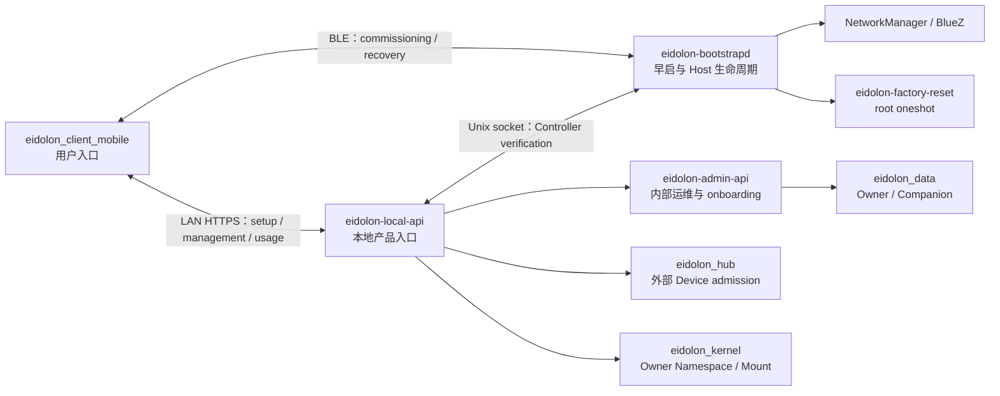

# Eidolon OS 本地 Bootstrap 与 Mobile 用户层实施计划

- 状态：Accepted，实施中
- 日期：2026-08-05
- 范围：本地首次接入、初始化、日常管理、换网、Controller 恢复、Reset、Owner 上下文
- 暂不包含：远程访问、Cloud Relay、跨网络账户登录、OTA 商业发布体系

## 0. 当前实施状态

截至 2026-08-05，Phase 0 的进程与信任基座已经落地：

- `eidolon-bootstrapd`、`eidolon-bootstrapctl`、`eidolon-local-api` 独立 entrypoint。
- Bootstrap 通过 `BootstrapStateStore` Port 保存必要权威状态；当前默认 adapter 是独占 SQLite，也有不持久化的 In-memory 测试实现。
- `CommissioningChannel` 和 `NetworkProvisioning` 已形成窄 Port；当前只有 In-memory adapter，未引入 BlueZ、NetworkManager 或 SoftAP 实现。
- daemon 启停和异常属于 systemd/journald 诊断日志，不再写入 Bootstrap authority store。
- 单实例 authority lock 防止两个 bootstrapd 同时运行；身份文件拒绝软链接和错误权限。
- systemd `Restart=always`、无限重试窗口和 watchdog；不依赖 `network-online.target`。
- Local API 当前只有只读 descriptor/state/host snapshot 和无状态 Host proof 路由，未接入 Admin 高权限面或产品 mutation。
- Mobile M2 已接通 Setup Trust：Debug App 验证 `dev issue` 的 Ed25519 签名、有效期和 Host 公钥派生身份，匹配 `GET /api/local/v1/host` 快照，再用随机 challenge 验证当前 Bootstrap 确实持有对应 Host 私钥。临时 secret 只保留在内存。
- 当前闭环的完成语义只是“带外身份已验证，并且当前 Bootstrap Local API 已完成 Host 私钥持有证明”，不等价于 Controller 已认领、网络已配置或 Workspace 已初始化；Audio/Hub/其他子项目不参与。
- 当前 M2 仍要求开发环境先提供一个 Mobile 可达的 Local API 地址；无网络开箱接入要等 commissioning channel 实现，不能把本阶段描述成已经解决无网发现与配网。
- Production 默认 fail closed：缺少制造身份时不生成临时产品身份，且拒绝 Dev Descriptor。
- AST 架构测试禁止 Bootstrap import Admin app、Data、Memory、NATS、Supervisor、torch 和 uvicorn。
- Phase 1 只读 Pi preflight 已准备，可采集 NetworkManager、Wi-Fi、BlueZ 与旧 RaspAP 服务事实，且不读取 Wi-Fi profile 内容。
- 根据当前实施范围，树莓派实机采集暂缓。因此尚未形成 Pi 网络/蓝牙能力结论，也不据此实现 D-Bus adapter。

尚未开始并且不能宣称完成：BlueZ GATT、NetworkManager D-Bus、Controller
认证、Owner 初始化 saga、Pi systemd 实机安装与故障注入。这些属于 Phase 1/2。

## 1. 背景与目标

Eidolon OS 运行在无屏树莓派主机上。最终用户不能依赖 SSH、HDMI、键盘或预先知道主机 IP，因此需要一个开箱即用的本地用户层：

1. 主机没有网络时，Mobile App 能识别并安全接入附近的 Eidolon OS。
2. App 能配置或切换树莓派 Wi-Fi，失败后设备仍可恢复。
3. App 能完成首个 Owner、主 Companion 和 Workspace 初始化。
4. 初始化后，App 成为本地日常管理与语音使用入口。
5. 丢失手机、网络配置错误或整机转让时，存在明确且安全的恢复路径。

`eidolon_client_mobile` 继续作为 Mobile codebase。树莓派侧能力放入
`eidolon_admin` codebase，但不能直接并入现有 Admin FastAPI 进程。

### 1.1 术语与逻辑边界

- **Setup**：Mobile 面向用户的引导与编排。它读取 Host 权威状态并投影步骤进度，不保存第二份可写的“setup 已完成”状态。
- **Bootstrap**：树莓派上永远常驻、自动重启的最小控制平面。它拥有 Host Identity、reset epoch、commissioning session 和后续 Controller/network/recovery 状态迁移。
- **Commissioning**：Bootstrap 提供的一段限时、认证控制会话，用于建立 Controller 和配置网络；它不是整个 Setup UI，也不是日常业务 API。
- **Local API**：网络可达后 Mobile 的本地产品入口。地址或 mDNS 只解决可达性；Descriptor 选定目标身份，nonce-bound Host proof 才把当前连接绑定到该身份。
- **Claim**：Bootstrap 接受一个 Controller 身份并形成可撤销授权的权威迁移；不能由 Mobile 本地标记代替。
- **Workspace onboarding**：Owner/Companion/Workspace 的业务初始化，权威在 Data/Admin，不属于 Bootstrap 自己的数据模型。

因此当前开发闭环严格按以下顺序推进：

```text
Host: bootstrapd 常驻
  -> 开发者签发短期 Dev Descriptor
  -> Mobile 验签并建立带外 Host 信任
  -> Mobile 读取 Local API host snapshot
  -> Mobile 匹配 Host ID / public key / fingerprint / BLE UUID / mode
  -> Mobile 发起随机 challenge，bootstrapd 返回带域隔离的 Host key 签名
  -> Mobile 验证 Host proof，防止把可重放的公开元数据误当成身份认证
  -> Host access setup 完成
  -> [下一阶段] commissioning channel + Controller claim + network
  -> [后续子项目] Owner / Companion / Workspace onboarding
  -> [最后迁移] conversation / Audio Channel
```

`Host access setup`、`Host commissioning` 和 `Workspace onboarding` 是三个连续但不同的完成点。当前 Mobile 不会因为读到了 `workspace_state=absent` 就修改 Bootstrap 状态，也不会把只读连接误报为整机开箱初始化完成。

## 2. 本次复盘后的决策变化

### 2.1 修订结论

上一版建议新建独立 `eidolon_bootstrap` 仓库。重新检查现有代码后，这个结论过度强调仓库隔离，低估了 `eidolon_admin` 已经承担的系统集成、Owner onboarding、服务健康和部署编排职责。

修订为：

> Bootstrap 放在 `eidolon_admin` 项目中实现；代码仓库共享，运行时、权限、入口和数据必须隔离。

目标形态是同一个 codebase 中的三个运行单元：

| 运行单元 | 启动阶段 | 网络暴露 | 权限 | 职责 |
|---|---|---|---|---|
| `eidolon-bootstrapd` | 早于完整 Eidolon stack | 不直接暴露普通 LAN API；BLE、Unix socket | 独立用户 + 最小系统权限 | Host Identity、commissioning、Controller Grant、NetworkManager、恢复与 Reset 编排 |
| `eidolon-local-api` | 独立于 Admin，可降级启动 | App 可访问的本地 HTTPS | 普通用户 | Controller 鉴权、Owner scope、产品 API/BFF、调用内部服务 |
| `eidolon-admin-api` | 完整 stack | 产品默认仅 loopback/支持模式 | 普通用户，但拥有运维能力 | 现有运维 UI、Supervisor、配置、日志、内部 onboarding |

代码同仓能够复用配置、测试、发布和内部 client；进程隔离保证 Admin 崩溃、完整 stack 未就绪或网络错误时，Bootstrap 仍然可用。

### 2.2 对上一版其他内容的修订

1. **二维码不能被当作开发前置条件。** 开发阶段使用每台 Pi 临时生成的 Dev Descriptor；产品阶段才进入制造身份和二维码/等价带外凭据流程。
2. **固定输入只允许做 Debug 入口，不作为固定秘密。** App 可以固定 BLE Service UUID、开发模式入口和默认字段，但真实 Pi 联调不应让所有设备共用一个硬编码 commissioning secret。
3. **SoftAP 不进入第一个 MVP。** 先验证 BLE + NetworkManager 是否能形成稳定闭环；SoftAP 是验证后的 fallback，不能预先假设单 Wi-Fi 芯片 AP/STA 并发可靠。
4. **Local API 先做最小面。** 第一阶段只覆盖 setup、system status、network 和 controller，不立即代理整个 Admin。
5. **Reset wipe list 不能靠路径猜测。** 每个数据拥有方必须发布显式 reset manifest，汇总完成前不得宣称 Factory Reset 已完成。
6. **Owner 切换与所有权转让分开。** App 内切换 Owner context 不改变任何权威归属；整机转让走 Factory Reset；外部 Device 跨 Owner 转移当前不支持。
7. **Android 先行。** 当前 Mobile 已有 Android 平台层；iOS 在协议稳定后补齐，不阻塞首个闭环。

## 3. 为什么可以放在 eidolon_admin，但不能塞进现有进程

### 3.1 适合放在同一项目的原因

1. `eidolon_admin` 已有 Owner onboarding、系统健康、服务目录、Supervisor 和多项目编排能力。
2. Local API 本质是产品 ingress/BFF，与 Admin 的集成适配器可以共享契约和 client，但对外暴露不同的允许列表。
3. Pi 发布当前已经以 Admin/supervisord 为集成中心；同仓可以降低版本锁定和发布协调成本。
4. Bootstrap 不拥有 Owner、Companion、Device 或 Mount 事实，仍可以通过 Port 调用原有权威服务，不会改变现有领域边界。

### 3.2 必须隔离的原因

1. 现有 Admin app 启动时初始化 Data、NATS、Supervisor client 等；Bootstrap 必须在这些依赖全部失败时仍能启动。
2. 现有 Admin 暴露 Supervisor、配置、日志和数据管理接口，不能向普通 Mobile Controller 直接开放。
3. Wi-Fi、BlueZ 和 Factory Reset 需要系统权限，不能授予整个 Admin API 进程。
4. 完整 stack 当前等待 `network-online.target`；无网络初始化能力不能位于等待网络之后。
5. `eidolon_admin` 当前基础依赖较重。Bootstrap entrypoint 必须保持 import-minimal，不得 import `eidolon_admin_server.app.main`、torch、DataStore、NATS 或 Supervisor。

### 3.3 明确禁止的实现方式

- 不在现有 `main.py` 中增加 BLE background task。
- 不给现有 Admin API root 权限或通用 NetworkManager 权限。
- 不让 Mobile App 直接访问 `/api/supervisor`、配置、日志或通用 service proxy。
- 不由 Bootstrap 直接修改 `eidolon_data`、Hub 或 Kernel SQLite。
- 不把 Controller 凭据复用为 Mobile Body 的 Device Identity。

## 4. 目标架构



### 4.1 建议目录

```text
eidolon_admin/
  contracts/
    bootstrap/v1/                 # Mobile 与 Host 的规范 schema
    local-api/v1/
  server/eidolon_admin_server/
    bootstrap/
      domain/                     # Host、ControllerGrant、Operation、ResetEpoch
      ports/                      # state、commissioning channel、network capability
      adapters/
        persistence/              # SQLite 默认实现 + In-memory 测试实现
        commissioning/            # 当前仅 In-memory；BlueZ adapter 后续实测再加
        network/                  # 当前仅 In-memory；NM adapter 后续实测再加
      daemon.py                   # bootstrapd entrypoint
      control.py                  # rootless Unix socket API
    local_api/
      app.py                      # 独立 FastAPI factory
      auth/                       # Controller challenge/session/request auth
      routes/                     # 明确 allowlist 的产品 API
      clients/                    # Admin/Hub/Kernel loopback clients
    app/                          # 现有 eidolon-admin-api，保持运维面
  deploy/
    systemd/
    polkit/
    reset-manifests/
  docs/architecture/
```

建议新增 entrypoints：

```text
eidolon-bootstrapd
eidolon-bootstrapctl
eidolon-local-api
eidolon-admin
```

开发环境可以继续由 supervisord 帮助启动 `local-api`；Pi 产品环境中
`bootstrapd` 和 `local-api` 应由 systemd 独立管理，不能成为完整 stack 的子进程。

## 5. 权威事实与数据边界

| 事实 | 唯一权威 | Bootstrap 是否保存 |
|---|---|---|
| Host ID、制造身份、reset epoch | Bootstrap | 是 |
| Controller public key、角色、允许的 Owner scope、撤销状态 | Bootstrap | 是 |
| Commissioning session、未完成 operation | Bootstrap | 是；属于恢复所需权威状态 |
| daemon 启停、异常和一般诊断日志 | systemd/journald | 否 |
| Wi-Fi connection profile 和密码 | NetworkManager | 否；Bootstrap 只保存 profile 标识和非敏感状态 |
| Owner、Companion、Persona、Workspace | `eidolon_data` | 否，只保存稳定 `owner_id` 引用 |
| 外部 Device admission、approved/revoked | Hub | 否 |
| Device Mount、Owner namespace、attachment | Kernel | 否 |
| Admin 运维配置、Supervisor 状态 | Admin | 否 |
| Mobile Body 设备私钥 | Mobile Keystore | 否 |

Bootstrap 必须有可跨重启恢复的 durable state，但领域和应用层只能依赖
`BootstrapStateStore`，不能依赖 SQLite API 或 schema。当前 SQLite 是默认 adapter，
它是单进程本地文件而不是额外数据库服务，并且不得与 Admin/Data 共用连接或 schema。
如果以后改成原子 snapshot 或其他 store，只替换 adapter。

当前只持久化：

- `bootstrap_state`
- `commissioning_sessions`

按实际功能落地后才增加：

- `controller_grants`
- `bootstrap_operations`
- `reset_state`

Host private key 始终是独立权限文件。daemon lifecycle、异常栈和一般 audit 信息进入
journald；普通日志文件不能作为 claim、Controller 或 operation 的恢复权威。如果某个
日志需要 replay 才能恢复状态，它就是一种 journal store，也必须通过同一 Port 实现
断电截断、fsync、schema migration、去重和原子提交，不能由业务层直接追加文本。

所有 mutation 使用稳定 `operation_id`、canonical fingerprint 和 `reset_epoch`。旧 epoch 的 session、operation 和 Controller token 全部失效。

## 6. 开发测试阶段：没有二维码怎么做

### 6.1 结论

App 端可以提供固定输入和手动录入，但要区分“固定开发入口”和“固定安全秘密”：

- 可以固定：BLE Service UUID、Dev 菜单入口、默认 Host 名称、模拟数据、开发环境地址。
- 不建议固定：所有树莓派共用的 commissioning secret、Host private key、产品可接受的万能配对码。

真实 Pi 联调建议使用每台设备临时生成的 `Dev Commissioning Descriptor`，由开发者通过现有 SSH 通道取得，再粘贴或导入 App。这样不依赖实体二维码，又使用与产品相同的身份绑定和加密流程。

### 6.2 分层开发模式

#### D0：纯 App/UI 模拟

- 当前自动化测试使用 deterministic、跨 Python/Dart 的签名向量和 Mock Local API。
- 用于 descriptor canonical JSON、篡改/过期、错误 Host、nonce 和 Setup UI 测试。
- 当前没有在运行时 App 内置 fake transport；自动化测试不连接真实 Pi，也不作为实机安全联调结果。

这个阶段允许固定测试 Host ID、签名和 nonce，因为它们只存在于 `test/` 与 contract example，不能进入真实 commissioning adapter。

#### D1：真实 Pi + 开发者有 SSH

Pi 以显式开发模式启动：

```text
EIDOLON_BOOTSTRAP_MODE=development
```

第一次启动时生成独立 Host key；开发者按需签发随机、短期的 Dev Descriptor：

```text
eidolon-bootstrapctl dev issue --ttl 30m
```

`dev issue` 当前输出可粘贴 JSON，包含：

- contract version
- host ID
- host public-key fingerprint
- 临时 commissioning secret
- BLE service UUID
- expiry

App Debug 页面当前只支持完整 JSON 粘贴，并执行签名、有效期、公钥派生身份、Local API Host metadata 匹配和随机 Host proof 验证。没有实现固定 pairing code、adb 注入、Dev URI 或扫码入口，不把计划中的便利形式描述成已有能力。

Descriptor 默认 30 分钟过期。重新签发会撤销尚未 consumed/revoked 的旧 session；真正的单次消费要由下一阶段 commissioning 协议落地，当前只读 Local API 闭环不能宣称已经消费 descriptor。

#### D2：接近产品的集成测试

- 镜像构建时为每台测试 Pi 注入唯一制造身份和一次性 secret。
- 生成 sidecar descriptor 文件，由测试系统保存；可以临时打印二维码或导入 App。
- 禁用 SSH 后仍然走产品相同的 BLE commissioning 协议。
- 验证错误设备选择、附近多台 Pi、重放、过期、断电和 reset epoch。

#### P：产品阶段

- 制造工序为每台设备生成唯一 Host Identity 和一次性 commissioning secret。
- 二维码位于机身或包装，至少绑定 Host ID、公钥指纹和一次性 secret；不包含私钥。
- 首次认领成功后一次性 secret 失效。
- 再次进入 recovery 必须满足物理动作；静态二维码本身不能夺回已认领设备。
- 如果最终产品不采用二维码，必须提供等价的唯一带外因子，例如 NFC、USB provisioning token 或可显示的一次性短码。对于无屏、无标签、无 NFC、无 USB 信任介质的设备，只能做物理按键后的 TOFU，无法同时保证“选中正确设备”和“抵抗附近主动攻击”。

### 6.3 Debug 通道防止进入产品

当前状态和产品化门槛如下：

1. **已实现**：Flutter 仅在 `kDebugMode` 显示 Dev Descriptor 输入；release UI 不显示。
2. **已实现**：Bootstrap production 模式缺少制造身份时 fail closed，并拒绝签发 Dev Descriptor。
3. **已实现**：运行时 commissioning secret 随机生成；源码与 Git 中只有明确标记的 test vector。
4. **待实现**：独立 dev/product flavor，以及对 Android release artifact 和 Pi product config 的 CI 负向检查。

当前真实 D1 链路不使用固定 pairing code，因此不预留万能码 feature flag。

## 7. 通道与信任协议

### 7.1 通道决策

| 通道 | 使用阶段 | 决策 |
|---|---|---|
| BLE GATT | 首次接入、换网控制、Controller recovery | 候选首选 adapter；实机 PoC 前不固化 GATT 细节 |
| LAN HTTPS | 初始化后、日常管理、语音使用 | 主业务通道；Host Identity pinning |
| SoftAP | BLE 不可用或恢复失败 | 后续 fallback；实机验证后再纳入 |
| mDNS | LAN 地址发现 | 仅提示；不能作为身份依据 |
| 固定 IP/固定网段 | 无 | 禁止 |

应用层当前只依赖 `CommissioningChannel` 的 packet 收发与生命周期，不知道 BlueZ、
GATT characteristic、MTU 或 notification。网络流程只依赖 `NetworkProvisioning` 的
stage/confirm/rollback，不知道 NetworkManager profile 或 D-Bus object path。当前用
In-memory adapter 验证状态边界；真实 adapter 等 Pi PoC 后增加，不预建通用插件系统。

### 7.2 安全原则

- BLE payload 必须有应用层身份认证、加密、抗重放和 transcript binding。
- 不自行发明密码协议。最终从有维护的成熟实现中选择，并完成 threat model 和互操作 PoC 后再写 ADR。
- QR/Dev Descriptor 只提供初始信任，不是长期 Controller credential。
- App 为 Controller 生成独立密钥；Android 使用 Keystore，iOS 使用 Keychain/Secure Enclave 可用能力。
- Local HTTPS pin Host public key 或 Host CA，不要求用户手工安装 Caddy 根 CA。
- Controller session 短期有效，可撤销，并包含 `reset_epoch`。
- Mobile Body Device Identity 与 Controller Identity 使用不同 key alias、contract 和生命周期。

## 8. 状态模型

不要设计一个包含所有组合的巨大枚举，采用正交状态轴：

```text
claim_state:
  unclaimed | claimed

network_state:
  unconfigured | staging | connected | degraded | rolling_back

workspace_state:
  absent | provisioning | ready | degraded

recovery_state:
  normal | physically_armed | controller_recovery | factory_reset_pending

operation_state:
  pending | running | waiting_confirmation | succeeded | failed | compensating
```

对外的综合状态由这些权威状态投影，不能单独写入第二份 `active` 标志。

## 9. 核心流程

### 9.1 首次初始化

首次初始化拆成三个有独立完成语义的阶段，不能用一个 Mobile 本地布尔值代替。

**A. Host access setup（当前已实现）**

1. `bootstrapd` 在无网络情况下常驻，并持有 Host Identity。
2. App 导入通过开发者 SSH 取得的 Dev Descriptor；产品阶段替换为制造带外凭据。
3. App 验证 descriptor 签名、有效期以及 Host ID/指纹是否由公钥正确派生。
4. App 连接开发阶段已知的 Local API 地址并读取单快照 `/api/local/v1/host`。
5. App 先匹配公开 metadata，再发送 32-byte 随机 challenge。
6. Local API 通过权限隔离的 Unix socket 请求 `bootstrapd` 生成 `eidolon-local-api-host-proof-v1` 签名；App 验签且 nonce 必须完全一致。
7. 完成条件是 descriptor 有效、snapshot 匹配、Host proof 有效。公开 metadata 匹配本身不算身份认证。

**B. Host commissioning（下一阶段，尚未实现）**

8. Commissioning channel adapter 可用后，双方建立认证加密会话；App 提交独立 Controller public key。
9. App 让用户确认 WLAN country、SSID 和凭据；Bootstrap 只通过 `NetworkProvisioning` Port staging 新网络。
10. 验证 association、IP/DHCP 和本地链路；远程/互联网连通性不作为当前成功条件。失败或超时则 rollback，设备保持可接入。
11. 网络成功后 App 切换到 pinned LAN HTTPS；Bootstrap 创建可撤销 Controller Grant 并使 commissioning secret 失效。
12. 该阶段完成条件是 `claim_state=claimed`、`network_state=connected`、`recovery_state=normal`；`workspace_state` 不阻塞 Host commissioning。

**C. Workspace onboarding（后续子项目接入，尚未实现）**

13. Local API 以内部服务身份调用 Admin onboarding，使用同一个 `operation_id` 创建/修复 Owner、主 Companion 和 Workspace。
14. Bootstrap 只保存稳定的 Owner 引用，不拥有 Owner/Companion/Workspace 数据。
15. 该阶段完成条件才包含 `workspace_state=ready`；之后再开放 conversation / Audio Channel。

Admin 当前 `/onboarding/initialize` 具有部分 repair 行为，但计划中必须补充显式 `operation_id`/Idempotency-Key、fingerprint 和可查询的结果，不能仅依赖“重复调用大概率没问题”。

### 9.2 换网

1. 已授权 Controller 创建 `change-network` operation。
2. Commissioning channel 保持控制能力；LAN 连接可能中断。
3. `NetworkProvisioning` adapter staging 新配置；真实 NetworkManager adapter 是否使用 checkpoint 由 PoC 固化。
4. 验证新网络的 association、DHCP、App 到 Local API 的本地可达性。
5. App 通过 commissioning channel 或新 LAN session 确认后提交变更。
6. 超时自动 rollback，Owner、Controller 和所有 Eidolon 数据保持不变。

不要求互联网可用。Guest isolation 导致 App 无法访问 Pi 时，必须给出明确诊断并允许 rollback 或进入 fallback，而不能误报 Wi-Fi 密码错误。

### 9.3 Controller 恢复

- 正常新增手机：现有 Host Admin 批准新 Controller。
- 旧手机丢失：物理动作进入限时 recovery，再使用产品 QR/等价凭据建立新 Controller。
- 新 Controller 建立后可以撤销旧 Controller。
- Controller 恢复不删除 Owner、Memory 或网络。
- “网络断开”本身不能自动开放无认证认领窗口。

### 9.4 Reset 分级

| 类型 | 清除 | 保留 | 授权 |
|---|---|---|---|
| Network Reset | Bootstrap 管理的 Wi-Fi profiles | Controller、Owner、Memory、Device/Mount | Host Admin 或物理动作 |
| Controller Reset/Recovery | 指定 Controller Grant | Owner、Memory、网络 | 现有 Host Admin，或物理 recovery |
| Factory Reset | 用户数据、Controller、运行期密钥、网络、日志/缓存/本地备份 | 软件 release、制造身份、硬件校准 | 物理长按 + App 确认，或两阶段物理确认 |

Factory Reset 由独立 root oneshot 执行：

1. 校验 bootstrapd 写入的、带 nonce 和 expiry 的 reset request。
2. 写入 durable reset marker。
3. 停止完整 stack。
4. 按签名/版本化 reset manifest 清除明确允许的路径和数据库。
5. 轮换运行期凭据并递增 `reset_epoch`。
6. 标记完成并重启。
7. 任一步断电后从 marker 继续，不启动半清除系统。

在每个服务提供 reset manifest 前，Factory Reset 阶段不得开始。manifest 至少由 Data、Memory、Hub、Kernel、Admin/Bootstrap、NATS/LiveKit 运行态和部署层共同确认。

### 9.5 Owner 语义

需要使用三个不同术语：

- `Host Controller`：有权管理这台 Eidolon OS 的手机密钥。
- `Owner`：Eidolon OS 中稳定的 namespace principal。
- `Device Owner Admission`：Hub 中某个外部 Device 被准入哪个 Owner。

V1 规则：

1. 一个 Controller Grant 可被授权访问一个或多个 Owner ID。
2. App 切换 Owner 只是选择已授权 scope；Local API 从 Grant 生成可信 Owner context，不能信任 App 自报的任意 `owner_id`。
3. 创建额外 Owner 需要 Host Admin 权限，并通过 Data/Admin authority 完成。
4. 整机转让走 Factory Reset。
5. Hub 当前不允许替换 approved Device 的 Owner，Kernel remount 也不能转移 Owner；V1 不实现外部 Device 跨 Owner 转移。

## 10. Local API 最小契约

第一阶段只提供最小 allowlist，不做通用 Admin proxy：

当前已实现：

```text
GET  /api/local/v1/descriptor
GET  /api/local/v1/host
POST /api/local/v1/host/proof
GET  /api/local/v1/system/state
```

下一阶段计划；在 Controller contract 和 mutation tests 落地前不算已有 API：

```text
POST /api/local/v1/auth/challenges
POST /api/local/v1/auth/sessions
POST /api/local/v1/setup/network-operations
GET  /api/local/v1/operations/{operation_id}
POST /api/local/v1/setup/initialize
POST /api/local/v1/network/change-operations
GET  /api/local/v1/controllers
POST /api/local/v1/controllers
DELETE /api/local/v1/controllers/{controller_id}
POST /api/local/v1/recovery/factory-reset-request
```

约束：

- 所有 mutation 都带 `Idempotency-Key`。
- Local API 根据已验证 Controller Grant 决定 Owner scope；客户端 body/header 不能扩大 scope。
- 下游 Admin/Hub/Kernel 使用独立 loopback service credential。
- Local API 只返回产品需要的状态，不暴露日志路径、环境变量、Supervisor socket 或内部 token。
- Bootstrapd 的控制接口使用 `0600/0660` Unix socket，不开放 TCP 管理端口。

## 11. Mobile 重构计划

保留现有 codebase 和已验证的 LiveKit/AEC/Avatar/Android Keystore 能力，但拆开 setup 与 conversation：

```text
lib/
  app/
  core/
    bootstrap_contracts/
    local_api_client/
    secure_storage/
    platform/
  features/
    bootstrap/
    system/
    owners/
    devices/
    conversation/
```

实施规则：

1. 先新增 App shell 与 bootstrap feature，不立即重写语音实现。
2. 把现有语音入口迁到 `conversation/`，只在 Host ready 后启用。
3. 拆分平台桥：`BleCommissioningBridge`、`ControllerKeyBridge`、`LocalNetworkBridge`、`MobileBodyKeyBridge`。
4. 当前用 Flutter `kDebugMode` 显示 Dev Descriptor 导入；release UI 不显示。独立 flavor 和 release artifact 负向检查仍是产品化待办。
5. 旧 `/api/device/register` HubClient 不参与 Host bootstrap。后续作为 Mobile Body 迁移到当前 Hub Enrollment/Handoff contract。
6. App 只访问 Local API；日常管理不直接访问 Admin/Hub/Kernel public port。

## 12. Pi 部署与网络改造

### 12.1 systemd 顺序

```text
local-fs.target
  -> NetworkManager.service + bluetooth.service
  -> eidolon-bootstrapd.service
  -> eidolon-local-api.service
  -> eidolon-stack.service（网络配置后启动或降级启动）
```

`bootstrapd` 不依赖 `network-online.target`。产品环境不由 supervisord 管理它。

### 12.2 权限

- Bootstrap 使用专用 Linux 用户。
- `eidolon` 用户不得永久加入 Bootstrap group；只有 Local API 的 systemd unit 通过进程级 `SupplementaryGroups=` 获得 Unix socket 权限，避免同用户的 Admin/supervisord 子进程继承该权限。
- NetworkManager/BlueZ 通过最小 D-Bus/Polkit 规则授权；具体调用集合由 PoC 后固化。
- Factory Reset helper 是唯一 root 单元，只接受验证过的本地 request 文件/Unix socket 调用，不监听网络。
- Admin API、Hub、Kernel 默认 bind loopback。
- Caddy 只暴露 Local API 与确实需要的媒体端点。

### 12.3 产品部署必须移除的假设

- 固定 `192.168.1.26`。
- 固定 `192.168.1.0/24` 防火墙规则。
- 依赖 Pi 已安装并配置 RaspAP/dnsmasq。
- 要求 App 用户手工安装 Caddy CA。
- 要求用户先安装 SSH key。

现有 SSH release installer 可以继续作为开发工具，但产品交付需要可重复构建的 Raspberry Pi OS Lite 镜像或等价首次启动镜像流程。

## 13. 分阶段实施计划

### Phase 0：术语、契约和依赖隔离

交付：

- Host/Controller/Owner/Device 的术语 ADR。
- Bootstrap v1 schema 和错误码草案。
- 新 entrypoint 空壳与 import boundary test。
- Debug/Production mode 配置和 release 负向检查。
- 物理 recovery 输入与状态反馈的产品决策记录；开发阶段不因此阻塞。

退出标准：

- `eidolon-bootstrapd --help` 在不 import Admin main、Data、NATS、torch、Supervisor 的环境中可运行。
- Release 构建无法启用 development descriptor issuer。

### Phase 1：Pi 5 + Android 技术 PoC

进入条件：

- 在目标 Pi 上成功执行只读 preflight，保存完整输出作为 PoC 基线。
- 明确当前 Wi-Fi authority 是 NetworkManager、RaspAP 还是其他组件；不得让两个组件同时写连接配置。
- 明确 `bluetooth.service`、BlueZ controller 和 `wlan0` 的实机状态。
- 若通过 SSH 执行开发预检，密钥安装属于开发运维动作，不能成为产品初始化依赖。

交付：

- BlueZ GATT advertisement、连接、分包、通知和重连 PoC。
- Android Debug App 的 Dev Descriptor 导入、Host 匹配和 Controller key 生成。
- NetworkManager D-Bus scan/stage/activate/checkpoint/rollback PoC。
- 真实路由器测试矩阵：2.4/5 GHz、隐藏 SSID、错误密码、DHCP 失败、guest isolation。
- Wi-Fi 切换期间 BLE 存活与错误恢复报告。
- 候选应用层安全库对比和 threat model；此阶段结束后才能确定最终握手协议。

退出标准：

- 错误 Wi-Fi 凭据不会让 Pi 失去可恢复通道。
- 同场多台 Pi 时 App 不会连接到错误 Host。
- BLE 断连、App kill、Pi reboot 后 operation 能恢复或安全失败。

### Phase 2：可用的首次初始化 MVP

交付：

- Bootstrap domain、SQLite authority、operation journal。
- `bootstrapd` 与 Local API 独立进程。
- Android setup UI：发现、认证、选网、进度、错误、Owner 初始化。
- Admin onboarding 加入 idempotency、fingerprint、operation result。
- Controller Grant 提升与 Owner scope。
- LAN HTTPS Host pinning。
- Caddy/防火墙关闭 Mobile 对 Admin/Hub/Kernel 的直达访问。

退出标准：

- 全新开发镜像在无屏、无预配置 Wi-Fi情况下，仅靠 App + Dev Descriptor 完成初始化。
- 在 setup 每个持久化步骤 kill/reboot 后不会创建重复 Owner/Companion/Workspace。
- 未授权附近手机不能配置网络或初始化 Owner。

### Phase 3：换网与 Controller 恢复

交付：

- Network change + checkpoint confirmation。
- Network Reset。
- 正常新增/撤销 Controller。
- 物理 recovery adapter 和限时 recovery session。
- BLE 不可用时是否加入 SoftAP 的实测决策；只有数据支持时才实施。

退出标准：

- 换网失败自动回滚，成功后 Owner/Data/Controller 不变化。
- 丢失旧手机后可通过物理动作恢复，但附近未授权手机不能主动开启 recovery。

### Phase 4：Factory Reset

交付：

- 每个服务的版本化 reset manifest。
- root oneshot helper、durable marker、power-loss resume。
- reset epoch、运行期密钥轮换和旧 Controller 失效。
- 数据残留扫描和隐私验收报告。

退出标准：

- 在 wipe 每一步断电，重启后都会继续到 unclaimed，而不是进入半初始化状态。
- Owner、Memory、voiceprint、Device registry/Mount、Controller、网络和相关本地备份无残留。
- 制造身份和可验证恢复能力仍存在。

### Phase 5：Mobile 产品层与语音迁移

交付：

- System、Owner、Device、Conversation 页面。
- 现有语音 Demo 迁入 `conversation/`。
- Mobile Body 按当前 Hub Enrollment/Handoff 和 Kernel Mount 流程接入。
- Controller Identity 与 Mobile Body Identity 的存储和测试隔离。

退出标准：

- Host 管理身份不能调用 Device 身份接口，反向亦然。
- 语音功能失败不影响 Bootstrap、换网和恢复。

### Phase 6：产品制造与 iOS

交付：

- 制造身份注入、descriptor/二维码生成和审计流程。
- 产品物理 recovery 交互。
- iOS CoreBluetooth、Keychain、Local Network 和 Host pinning 实现。
- 产品镜像、release flavor 和生产安全验收。

## 14. 测试与验收矩阵

### 功能

- 无网络、无屏冷启动。
- 同场 1/5/20 台未认领 Pi 的正确匹配。
- 错密码、隐藏 SSID、WPA2/WPA3、DHCP 超时。
- 网络切换成功、失败和 App 中途退出。
- 已初始化但完整 stack 故障时仍能查看 bootstrap 状态和恢复网络。
- 多 Owner scope 切换和越权拒绝。

### 安全

- BLE 被动监听和主动 MITM。
- Descriptor 重放、过期、重复使用和 reset epoch 重放。
- Controller request nonce/replay。
- Debug credential、dev URI 和 development mode 不出现在 release artifact。
- Local API 越权访问 Admin/Supervisor/任意 Owner。
- Factory Reset 未经物理授权不得执行。
- 日志不得包含 Wi-Fi 密码、commissioning secret、Controller private key 或下游 service token。

### 故障与持久化

- 每个 operation durable step 前后断电。
- Bootstrap SQLite 损坏、磁盘满、只读文件系统。
- BlueZ/NetworkManager 重启。
- Admin/Data/Hub/Kernel 单独不可用。
- Factory Reset 每一步断电与重复执行。

## 15. 尚未伪装成结论的开放项

以下问题必须通过产品选择或实机证据关闭，当前不宣称已确定：

1. 最终应用层握手协议和具体库。
2. 产品采用二维码、NFC、USB token 还是其他带外凭据；无屏产品至少需要其中一种或接受 TOFU 风险。
3. 机身是否有 GPIO recovery button、按压时序和 LED/声音反馈。
4. Pi 5 单 Wi-Fi radio 的 SoftAP fallback 切换策略和不同地区监管域行为。
5. Local API 的最终 TLS 终止位置：自身 TLS 或 Caddy；无论哪种都必须绑定 Host Identity。
6. 每个现有服务的完整 reset manifest 和隐私数据清单。
7. 一个 Host 是否允许多个 Host Admin，以及多 Owner 的产品授权 UX。

## 16. 总体验收标准

只有以下条件全部满足，才能称为“Eidolon OS 开箱即用用户层”：

1. 新 Pi 不需要 SSH、屏幕、固定 IP、固定网段或手工安装 CA。
2. App 可以完成本地发现、可信认领、配网和 Owner/Workspace 初始化。
3. 错误网络、断电、App kill 或完整 stack 故障不会让恢复通道消失。
4. 日常 App 只能访问 Local API，Admin/Hub/Kernel 高权限面不直接暴露。
5. 网络 Reset、Controller Recovery、Factory Reset 的语义和数据保留范围彼此独立。
6. 产品 artifact 中不存在 Debug commissioning 后门。
7. 所有状态迁移幂等、可审计、带 reset epoch，跨 Owner 默认 fail closed。

## 17. 参考依据

- Raspberry Pi OS 从 Bookworm 起默认使用 NetworkManager：<https://www.raspberrypi.com/documentation/configuration/computers/raspberry-pi.html>
- NetworkManager `AddConnection2`：<https://networkmanager.dev/docs/api/latest/gdbus-org.freedesktop.NetworkManager.Settings.html>
- NetworkManager Checkpoint/Rollback：<https://networkmanager.dev/docs/api/latest/gdbus-org.freedesktop.NetworkManager.html>
- BlueZ GATT D-Bus API：<https://bluez.readthedocs.io/en/latest/gatt-api/>
- Android BLE 与应用层安全要求：<https://developer.android.com/develop/connectivity/bluetooth/ble/ble-overview>
- Apple CoreBluetooth：<https://developer.apple.com/documentation/corebluetooth/>
